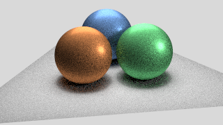

# Path tracing
> Path tracer that renders photorealistic images

## Gallery

### Dragon


### Chess


### Cornell Box


### Three Spheres




## Usage

To render an image, simply provide an XML file describing the scene (lighting, materials, meshes, camera, renderer, etc.) as input. There are example XML files in the `scene` directory.

```sh
// Build project
$ ant
// Render an image using an input XML file
$ java -cp carbine.jar ray.ParaRayTracer scene/cbox-global.xml
```

## Scenes

In addition to the test Cornell box scenes (and a sphere rendering test), I have created two additional *"creative"* scenes.

The first scene is `dragon.xml` which has the Cornell dragon placed in an empty Cornell box with two spheres of light for illumination. The `.obj` files (and converted `.msh` equivalents) are included in the `scene` directory.

The second scene is `chess.xml` which has a chessboard and chess pieces placed in a Cornell box. The only light in the scene is the square ceiling light.

## Report

There are four implemented renderers: ambient occlusion, direct illumination, brute force (global illumination) path tracing, and Russian roulette path tracing. All of the renderers have been fully-implemented.

**Note**: My implementation of `rayRadianceRecursive()` and `gatherIllumination()` for the brute force path tracer (and the Russian roulette path tracer) do not use mutual recursion. Instead, the recursive computation of reflected radiance is computed entirely in `gatherIllumination()`.

### Results

Overall, the generated renders provide seemingly accurate results. The only anomaly I encountered was that the Russian roulette path tracer appears to add quite a bit of noise to the rendered image when compared to the brute force global illumination method. I suspect that this comes from the increased variance in the computed pixel samples due to the random probability that a recursive ray reflection gets terminated. The resulting Russian roulette renders would likely look much smoother given a higher number of samples per pixel.
